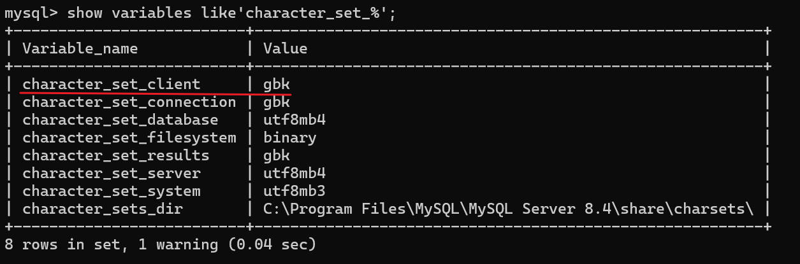
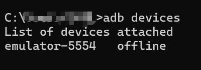
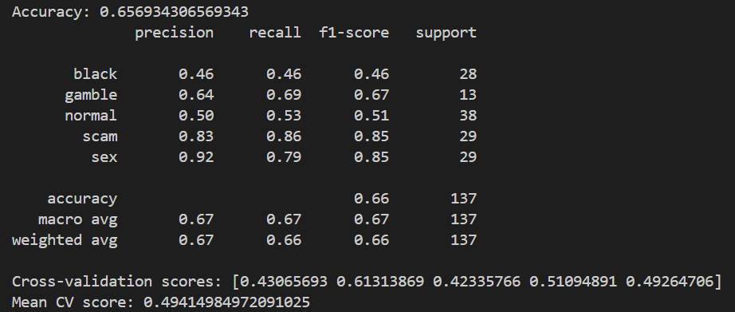

# AppAnalysisSystem

__基于多特征融合和集成学习的涉诈 APP 智能识别分析系统__

第十三届“中国软件杯”大学生软件设计大赛 A 组赛题 [A2 -涉诈APP智能识别分析系统](https://www.cnsoftbei.com/content-3-980-1.html) 落榜作品。

前后端分离架构，前端基于 [vue-element-admin](https://github.com/PanJiaChen/vue-element-admin) 二次开发，后端基于 Django 框架开发（比赛版本使用的是 Flask 框架）。

## 目录📌

- [项目目录](#项目目录)
- [环境要求](#环境要求)
- [配置过程](#配置过程)
- [使用方法](#使用方法)
- [说点什么](#说点什么)
- [License](#License)

## 项目目录

- AppAnalysisSystem：项目后端文件夹
- AppAnalysisSystem-web：项目前端文件夹

## 环境要求

### 推荐版本

- Windows 11

- Python 3.9.7

- pip3

- MySQL 8.4.0

- Node 16.5.1

- JDK 1.8（必须）

- SDK

  > [安装教程](https://blog.csdn.net/Yocczy/article/details/130916750)
  >
  > 注：建议多下几个版本的 API 以扩大兼容性，防止使用本系统时出现意外错误。

  SDK 安装后测试：

  ```shell
  # cmd窗口输入
  
  adb
  ```

  若正常回显，则说明安装配置成功。

- 雷电模拟器最新版

### 注意⚠

如果电脑曾经安装了其他版本的 JDK，即使切换到 JDK 1.8，在使用本系统时，仍然会出现由于 JDK 版本不匹配而产生的问题。

具体表现为：测试多个 APK 时，在系统首页中，签名证书那一项的 `MD5` 和 `有效期` 字段总为空。因为非 JDK 1.8 版本，如 JDK 11，使用 JDK 内置 keytool 工具解析的 APK 签名证书，在格式上有所不同。

一种较为有效的解决方法：[方法](https://blog.csdn.net/weixin_43990532/article/details/126351285)。

## 配置过程

### APKtool 环境变量配置

1. 进入后端目录，AppAnalysisSystem/AppAnalysisSystem；

2. 找到 apktool 文件夹，右键，选择”复制文件地址“；

3. 添加环境变量：进入 Windows 系统设置 → 搜索”查看高级系统设置“ → 点击”环境变量“ → 找到系统变量“Path” → 点击“编辑” → 点击“新建” → 输入上一步复制的 apktool 文件地址 → 保存；

4. 验证环境变量是否配置成功：

   ```bash
   # cmd窗口
   
   apktool
   ```

   如果正常回显，说明安装成功。

### 数据库

1. 进入 MySQL 命令行工具；

2. 检查 client 字符集：`show variables like'character_set_%';` ；

   

3. 如果 `character_set_client ` 不是 `utf8mb4` ，则输入 `set names utf8mb4;` ；

4. 导入后端项目中的 mysql.sql 文件：`source <path-to-mysql.sql>;` 。

5. 更改项目相关配置：进入后端项目文件夹，找到 AppAnalysisSystem/AppAnalysisSystem/settings.py，将数据库用户名和密码替换。

   ```python
   DATABASES = {
       'default': {
           'ENGINE': 'django.db.backends.mysql',
           'NAME': 'app-analysis-system',
           'HOST': '127.0.0.1',
           'PORT': 3306,
           'USER': 'root',
           'PASSWORD': 'root',
       }
   }
   ```

### 雷电模拟器

启动模拟器 → 点击“设置” → 其他设置 → ROOT权限 → 开启 → 重启模拟器。

### 前端

```shell
# 进入前端目录
cd AppAnalysisSystem-web

# 安装依赖
npm install

# 启动前端
npm run dev
```

### 后端

```shell
# 进入后端目录
cd AppAnalysisSystem

# 安装依赖
pip install -r requirements.txt

# 启动后端
python manage.py runserver 0.0.0.0:8000
```

## 使用方法

### 步骤

1. 启动雷电模拟器，完全启动成功后在 cmd 窗口输入 `adb devices` ，确保命令的结果为如下格式：

   ```
   List of devices attached
   emulator-5554   device
   ```

   即存在设备且设备状态不是 `offline` ，否则，多输入几次  `adb devices` 。

   下图为 `offline` 的情况：

    

2. 启动后端。
3. 启动前端。
4. 在浏览器输入 ` http://localhost:8080/` ，即可使用本系统。

### 注意⚠

使用本系统时请不要打开 VPN 工具。

## 说点什么

### 关于作品

前端基于 [vue-element-admin](https://github.com/PanJiaChen/vue-element-admin) 二次开发，因为它本身是一个仓库，不好一起放上来，所以打包成了压缩包。

作品还有很多可以改进和完善的地方，目前相当于只是做了一个大体的壳出来。

可优化的点如下：

- __整个前端__。做成数据可视化平台的样子，而不是像现在这样的管理系统。

- __增加黑白名单配置和展示功能__。如果采集的 APK 不在数据库的名单中，则可自动向数据库里增加这个 APK 的条目，并且能够在前端增删改查和展示数据库中 APK 名单。

- __图片涉黄检测模型自己写一个__。当初花了很长时间找的一个比较满意的开源模型，结果无法集成到系统中使用，原因无法得知。也尝试过购买商务接口，但单张图片的检测时间太长了，无法接受，所以最好的方法就是自己造轮子。

- __研判模型改进__。系统中使用的研判模型的精确度实在太低了，如下：

  

- __特征提取和特征工程改进__。关于特征提取，自认为已经做得挺好了。参考了很多文献，基本上能提的都提出来了，印象中只用 API 调用情况和 small 字节码分析没有做，可能还有一些动态特征？特征工程的话，怎么编码、保留哪些特征都是可以改进的，当然要配合研判模型一起做。

- __尝试做文本语义类别划分__。这是当初想要做的点，但似乎技术难度比较大就搁置了。就是将静态存在于 APK 反编译后的文件中的所有字符串，加上从 APK 图片中 OCR 识别出来的字符串，先做一个清洗和预处理，然后做标签划分。

### 碎碎念

这是我第一次做与科研相关的项目，也是第一次带队打比赛做项目。整个团队就我有点经验，当然也就只能是我承担几乎所有的任务。前后 50 多天的高强度工作，前期还是早 9 晚 10，后面就基本上是早 8 晚 10，三餐随便搞搞，也熬了几个大夜。

很遗憾最终落榜了，但也不失为一次十分宝贵的经历。没有这次经历，我肯定是走不到现在这个位置的。

中国软件杯失败了，想着打打别的好打一点的比赛，但事情总不是那么如愿的。团队成员的忙，自身时间的尴尬，作品优化的静止……

那就这样吧，遗憾总是存在的，事情总是有得有失。让我达到了现在的高度，但也错失了北邮网安的夏令营，那是我中学和本科都很想去的地方，是我离天枢、离网安、离 CTF 最近的一次。同时也失掉了另外一个比赛拿到更高奖项的机会，或许那样我可以走得比现在更远。唉，无论如何，尘埃已定，就让这段时光尘封吧。

至于代码和文书，我已经不想管了，就这样了吧，虽然真的很屎山。物极必反，前面投入的太多了，现在对这个项目、这个课题、这个研究领域已经提不起丝毫兴趣了。

现已将在比赛版本上进行小改进的源码，以及比赛时提交的文书资料（文档、PPT）开源。欢迎大家学习和参考，提出宝贵的意见或者直接参与贡献。

比赛数据集文件过于庞大，需要可联系作者。

最后，感谢蒋老师、袁同学、谭同学和两个研究生学长，以及曾经努力的自己🎉。

### 鸣谢❤

- [vue-element-admin](https://github.com/PanJiaChen/vue-element-admin)
- [NSFW Model](https://github.com/rockyzhengwu/nsfw)
- [MobSF](https://github.com/MobSF/Mobile-Security-Framework-MobSF)

## License

[MIT](https://github.com/Nampuchain/AppAnalysisSystem/blob/main/LICENSE)

Copyright©2024 JCYT
